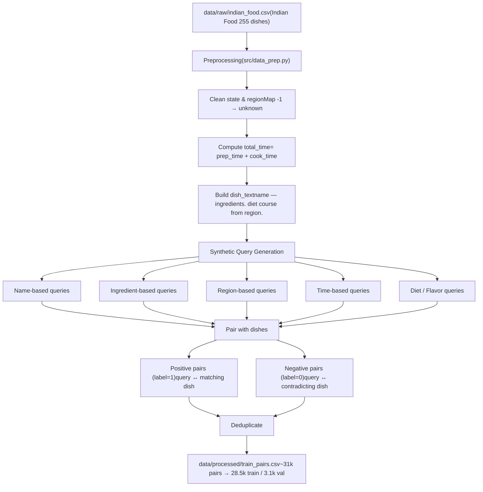

# DATA.md – Training Data Summary

This file explains, briefly, how `data/processed/train_pairs.csv` is created for the
Swiggy query → dish ranking assignment.

---

## Pipeline Flow



---

## 1. Source dataset

- File: `data/raw/indian_food.csv`
- Dataset: **Indian Food 101** (Kaggle)
- Columns used:
  - `name`
  - `ingredients`
  - `diet`
  - `prep_time`, `cook_time`
  - `flavor_profile`
  - `course`
  - `state`, `region`

---

## 2. Preprocessing

All logic lives in `src/data_prep.py`:

- Load the CSV with pandas
- Clean / normalize `state` and `region`
- Map missing or `-1` values to `"unknown"`
- Compute:

  ```text
  total_time = prep_time + cook_time
  ```

- Build a single `dish_text` string per row, for example:

  ```text
  Gajar ka halwa — Carrots, milk, sugar, ghee, cashews, raisins.
  vegetarian sweet dessert from Punjab, North India.
  ```

This `dish_text` is used as the `dish` field for training and inference.

---

## 3. Synthetic queries and labels

For each dish, the script generates several synthetic query types, such as:

- Name‑based: `"{name}"`, `"{name} recipe"`
- Ingredient‑based: `"dessert with {ingredient}"`, `"{course} with {ingredient}"`
- Region‑based: `"{state} dessert"`, `"south indian main course"`
- Time‑based: `"quick {course} under 15 minutes"` for dishes with small `total_time`
- Diet / flavor: `"vegetarian {course}"`, `"spicy {course}"`, etc.

Each final row in `train_pairs.csv` is:

```text
(query: str, dish: str, label: int)
```

- **Positive (label = 1)**  
  Query is generated from the **same** dish and matches its attributes
  (course, region, diet, time, ingredients).

- **Negative (label = 0)**  
  Same query paired with **other** dishes that contradict some of those attributes
  (different region, course, diet, or time). Negatives are sampled, not exhaustive.

After generation:

- All examples are concatenated
- Exact duplicates are dropped
- The result is written to `data/processed/train_pairs.csv`

For the run used in the assignment, there are roughly:

- ~31k total pairs
- ~28.5k training examples
- ~3.1k validation examples

---

## 4. Data limitations (brief)

- Synthetic, template-generated queries only
- Only 255 dishes in catalog
- No restaurant / price / availability info
- No nutrition or macro fields
- Mostly vegetarian, very few non-veg
