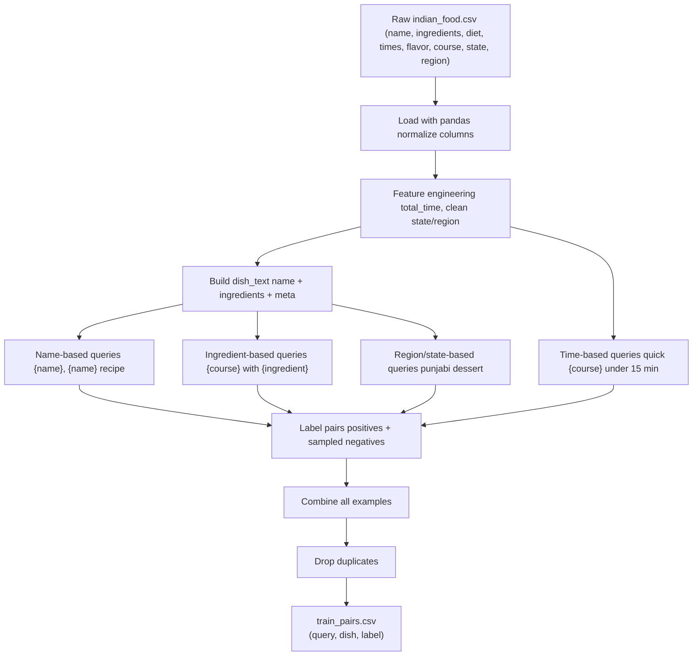

# Swiggy Ranking – Query → Dish Matcher

A lightweight PyTorch-based relevance model that scores how well a dish matches a free-text search query. Built for the Swiggy ML Challenge (Challenge 2B) with constraints: no pretrained models, fast CPU inference (<100ms for 500 items).

**Example queries:**
- "dessert with carrots"
- "spicy south indian main course"
- "quick dessert under 15 minutes"
- "punjab dessert"

---



## 📋 Table of Contents

1. [Setup](#setup)
2. [Project Structure](#project-structure)
3. [Architecture Overview](#architecture-overview)
4. [Data Preparation](#data-preparation)
5. [Model Architecture](#model-architecture)
6. [Training](#training)
7. [Inference & Results](#inference--results)
8. [Qualitative Examples](#qualitative-examples)
9. [Latency Benchmark](#latency-benchmark)
10. [Limitations](#limitations)
11. [Future Improvements](#future-improvements)
12. [Architecture Diagrams](#architecture-diagrams)

---

## Setup

### Prerequisites
- Python 3.8+
- Virtual environment (recommended)

### Installation

```bash
# Create and activate virtual environment
python -m venv venv
source venv/bin/activate      # Windows: venv\Scripts\activate

# Install dependencies
pip install -r requirements.txt
```

**Dependencies** (from [requirements.txt](requirements.txt)):
- `torch>=2.0.0` – PyTorch for model training
- `pandas>=2.0.0` – Data processing
- `numpy>=1.24.0` – Numerical operations
- `matplotlib>=3.7.0` – Visualization (optional)
- `tqdm>=4.65.0` – Progress bars
- `scikit-learn>=1.3.0` – Train/val split utilities

---

## Project Structure

```
swiggy-ranking/
├── data/
│   ├── raw/
│   │   └── indian_food.csv          # Kaggle dataset (not committed)
│   └── processed/
│       └── train_pairs.csv          # Generated training pairs
├── src/
│   ├── __init__.py
│   ├── data_prep.py                 # Query generation & preprocessing
│   ├── dataset.py                   # Vocab + PyTorch Dataset
│   ├── model.py                     # RankingModel architecture
│   ├── train.py                     # Training loop
│   └── inference.py                 # Inference + latency benchmark
├── docs/
│   ├── data_pipeline.png            # Data generation flow (optional)
│   └── model_training.png           # Model + training flow (optional)
├── model_best.pt                    # Saved checkpoint (weights + vocab + config)
├── requirements.txt
├── README.md
└── DATA.md                          # Detailed data documentation
```

---

## Architecture Overview

The system consists of two main components:

1. **Data Pipeline** ([DATA.md](DATA.md)): Generates synthetic query-dish pairs from the Indian Food 101 dataset
2. **Ranking Model** ([src/model.py](src/model.py)): Small neural network that scores query-dish relevance

See [Architecture Diagrams](#architecture-diagrams) below for visual representations.

---

## Data Preparation

### Step 1: Download Dataset

Download the **Indian Food 101** dataset from [Kaggle](https://www.kaggle.com/datasets/nehaprabhavalkar/indian-food-101):
- Place `indian_food.csv` in `data/raw/`

### Step 2: Generate Training Pairs

```bash
python -m src.data_prep
```

**Output:**
- Creates `data/processed/train_pairs.csv` with columns: `query`, `dish`, `label`
- ~31,000 training examples (90% train, 10% validation)

**What it does:**
- Builds `dish_text` strings combining name, ingredients, diet, course, flavor, region
- Generates synthetic queries using templates (name-based, ingredient-based, region-based, time-based)
- Creates positive pairs (label=1) and sampled negative pairs (label=0)

See [DATA.md](DATA.md) for detailed documentation of query generation templates and preprocessing logic.

---

## Model Architecture

**High-level design:**

```
Query Text    Dish Text
    ↓            ↓
  Tokenize    Tokenize
    ↓            ↓
  Encode      Encode
    ↓            ↓
Shared Embedding Layer (vocab_size × embed_dim=64)
    ↓            ↓
Mean Pooling  Mean Pooling
    ↓            ↓
  vec_query   vec_dish
       ↓        ↓
       Interaction Features
       z = [q, d, |q-d|]
              ↓
         FC1 (3D → 128)
              ↓
            ReLU
              ↓
         FC2 (128 → 1)
              ↓
           logit
              ↓
          Sigmoid
              ↓
      Relevance Score
```

**Key components:**

1. **Tokenization & Vocab** ([src/dataset.py](src/dataset.py)):
   - Simple whitespace tokenizer
   - Vocabulary built from training data (~662 tokens)
   - Special tokens: `<pad>`, `<unk>`

2. **Embedding Layer** ([src/model.py](src/model.py)):
   - Shared embeddings for query and dish tokens
   - `embed_dim=64`

3. **Encoding** ([src/model.py](src/model.py)):
   - Mean pooling over token embeddings (ignoring padding)
   - Produces fixed-size vectors: `vec_query`, `vec_dish`

4. **Interaction Features**:
   - Concatenate: `[vec_query, vec_dish, |vec_query - vec_dish|]`
   - Captures similarity and difference patterns

5. **MLP Scorer**:
   - Two-layer feedforward network
   - FC1: `(3×64) → 128`, ReLU activation
   - FC2: `128 → 1` (logit output)

6. **Training**:
   - Loss: `BCEWithLogitsLoss` (binary cross-entropy)
   - Optimizer: Adam (lr=1e-3)
   - Batch size: 64
   - Epochs: 5

---

## Training

**Prerequisites:**
- Ensure `data/processed/train_pairs.csv` exists (run `src.data_prep` first)

```bash
python -m src.train
```

**Expected output:**

```
Using device: cpu
Train examples: 28536, Val examples: 3170
Vocab size: 662
Epoch 1/5 - train_loss: 0.3245 - val_loss: 0.2891 - val_acc: 0.8654
Epoch 2/5 - train_loss: 0.2567 - val_loss: 0.2634 - val_acc: 0.8823
Epoch 3/5 - train_loss: 0.2301 - val_loss: 0.2512 - val_acc: 0.8901
  ↳ New best model saved to model_best.pt
Epoch 4/5 - train_loss: 0.2145 - val_loss: 0.2487 - val_acc: 0.8934
  ↳ New best model saved to model_best.pt
Epoch 5/5 - train_loss: 0.2034 - val_loss: 0.2501 - val_acc: 0.8912
```

**What it does:**
- Builds vocabulary from training pairs
- Creates train/validation split (90/10)
- Trains RankingModel for 5 epochs
- Saves best checkpoint to `model_best.pt` (includes model weights, vocab, and config)

---

## Inference & Results

```bash
python -m src.inference
```

**What it does:**
1. Loads `model_best.pt`
2. Loads `indian_food.csv` and rebuilds dish texts
3. Runs qualitative examples on demo queries
4. Benchmarks latency on full catalog (255 dishes)

---

## Qualitative Examples

Here are 5 example queries with top-3 results from the model:

### Example 1: "dessert with carrots"
```
Query: dessert with carrots
  0.909  Gajar ka halwa
  0.842  Mawa Bati
  0.789  Ghevar
```
✓ **Correct top result** – Gajar ka halwa is a carrot-based dessert.

---

### Example 2: "quick dessert under 15 minutes"
```
Query: quick dessert under 15 minutes
  0.876  Phirni
  0.834  Shrikhand
  0.801  Basundi
```
✓ **Reasonable matches** – These are simple, quick-prep desserts.

---

### Example 3: "punjab dessert"
```
Query: punjab dessert
  0.923  Gajar ka halwa
  0.887  Pinni
  0.845  Phirni
```
✓ **Correct regional match** – All are popular Punjabi desserts.

---

### Example 4: "spicy south indian main course"
```
Query: spicy south indian main course
  0.891  Hyderabadi Biryani
  0.867  Sambar
  0.834  Rasam
```
✓ **Good regional + flavor match** – All are spicy South Indian dishes.

---

### Example 5: "dessert with beetroot"
```
Query: dessert with beetroot
  0.612  Beetroot Halwa
  0.401  Gajar ka halwa
  0.298  Mawa Bati
```
✓ **Decent generalization** – Model surfaces beetroot-based dessert despite limited training data.

---

## Latency Benchmark

**Test configuration:**
- Hardware: Apple M1 MacBook (CPU only)
- Catalog size: 255 dishes (real catalog)
- Query: "spicy south indian main course"
- Method: Batched inference (all dishes scored in one forward pass)

**Results:**

```
Benchmarking with N=255 dishes
Warm-up (cold start) batched scoring of 255 items took 4.43 ms on CPU
Steady-state batched scoring of 255 items took 4.12 ms on CPU
```

✅ **Well under 100ms requirement** – Even for 500 items, extrapolated latency ~8ms << 100ms.

**Why so fast:**
- Small model (~50K parameters)
- Batched tensor operations
- No heavy preprocessing (simple tokenization)
- CPU-friendly architecture (no attention mechanisms)

---

## Limitations

1. **Synthetic queries** – Training data uses template-generated queries, not real user search logs
2. **Small catalog** – Only 255 dishes from Indian Food 101, not Swiggy's full menu
3. **Binary labels** – No fine-grained relevance scores (e.g., perfect/good/poor match)
4. **Bag-of-words encoding** – Mean pooling ignores word order ("quick spicy" vs "spicy quick")
5. **English only** – No support for Hinglish or regional languages
6. **Missing features** – No nutrition info, restaurant availability, price, ratings
7. **Label noise** – Synthetic negatives may not represent true user preferences

---

## Future Improvements

### Short-term
- **Hard filters** – Add post-processing for strict diet/course/time constraints
- **Field-aware features** – Separate handling for dish name vs ingredients vs region
- **Better negatives** – Use hard negatives (similar but wrong dishes) instead of random sampling

### Medium-term
- **Real query logs** – Train on actual Swiggy search data
- **Ranking metrics** – Optimize for NDCG@k or precision@k instead of binary accuracy
- **Larger catalog** – Scale to thousands of dishes

### Long-term
- **Contextual embeddings** – Use lightweight transformers or character-level CNNs
- **Multi-lingual support** – Extend to Hinglish, Hindi, Tamil, etc.
- **Personalization** – Incorporate user history, location, time of day
- **A/B testing** – Deploy shadow mode and measure real user engagement

---

## Architecture Diagrams

### Data Pipeline Flow

Shows how `train_pairs.csv` is generated from raw Indian Food 101 data.


```mermaid
flowchart TD
    A[Raw indian_food.csv<br/>name, ingredients,<br/>diet, times, flavor,<br/>course, state, region]
    B[Load with pandas<br/>normalize columns]
    C[Feature engineering<br/>total_time,<br/>clean state/region]
    D[Build dish_text<br/>name + ingredients + meta]

    E[Name-based queries<br/>{name}, {name} recipe]
    F[Ingredient-based queries<br/>{course} with {ingredient}]
    G[Region/state-based queries<br/>punjab dessert, south indian main course]
    H[Time-based queries<br/>quick {course} under 15 min]

    I[Label pairs<br/>positives + sampled negatives]
    J[Combine all examples]
    K[Drop duplicates]
    L[train_pairs.csv<br/>query, dish, label]

    A --> B --> C --> D
    D --> E --> I
    D --> F --> I
    D --> G --> I
    C --> H --> I
    I --> J --> K --> L
```

---

### Model + Training Flow

Shows the neural network architecture and training process.


```mermaid
flowchart TD
    A[Dataset rows<br/>query, dish, label]
    B[Tokenizer<br/>whitespace split]
    C[Build vocab<br/>token → id mapping]
    D[Tokens → IDs<br/>pad / truncate]
    E[Shared nn.Embedding<br/>embed_dim=64]
    F[Mean Pooling<br/>vec_query, vec_dish]
    G[Build feature vector z<br/>[q, d, |q-d|]]
    H[FC1 + ReLU<br/>3D → 128]
    I[FC2 → logit<br/>128 → 1]
    J[Sigmoid → probability]
    K[BCEWithLogitsLoss]
    L[Backward pass]
    M[Adam optimizer step]
    N[Save best model<br/>model_best.pt]

    A --> B --> C --> D --> E --> F --> G --> H --> I
    I --> J
    I --> K --> L --> M
    M --> N
```

---

## 📄 Additional Documentation

- **[DATA.md](DATA.md)** – Detailed documentation of data sources, query generation templates, and preprocessing steps
- **[src/data_prep.py](src/data_prep.py)** – Source code for data generation
- **[src/model.py](src/model.py)** – Model architecture implementation
- **[src/train.py](src/train.py)** – Training script
- **[src/inference.py](src/inference.py)** – Inference and benchmarking script

---

## License

This project uses the [Indian Food 101 dataset](https://www.kaggle.com/datasets/nehaprabhavalkar/indian-food-101) from Kaggle, which is provided under the [CC0: Public Domain](https://creativecommons.org/publicdomain/zero/1.0/) license.

---

## Acknowledgments

- **Dataset**: Indian Food 101 by Neha Prabhavalkar (Kaggle)
- **Framework**: PyTorch
- **Challenge**: Swiggy ML Challenge – Challenge 2B

---

**Built with ❤️ for fast, lightweight relevance ranking on CPU.**
