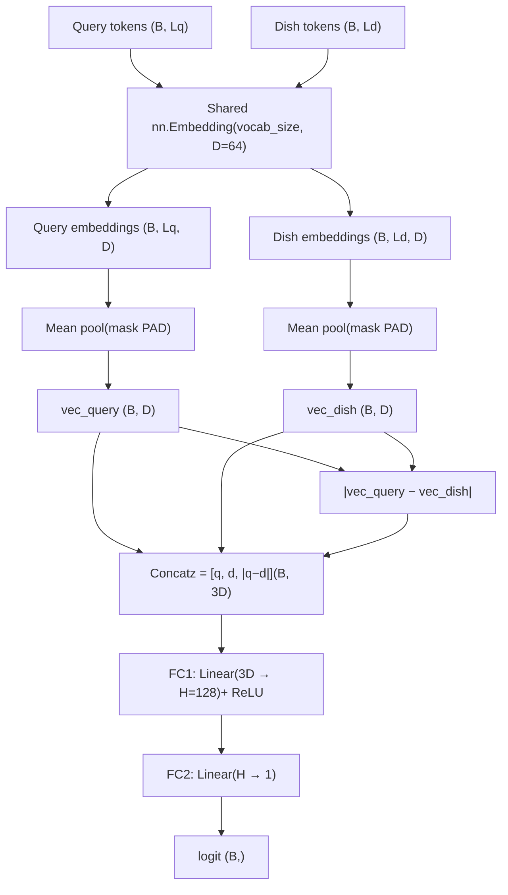
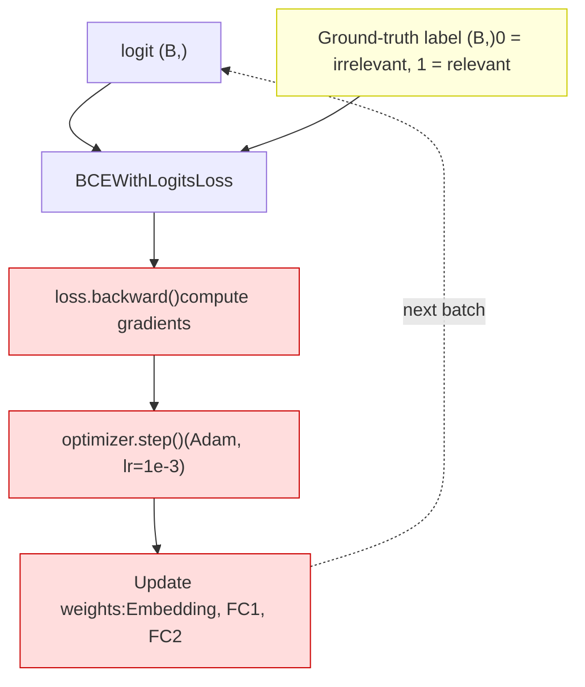
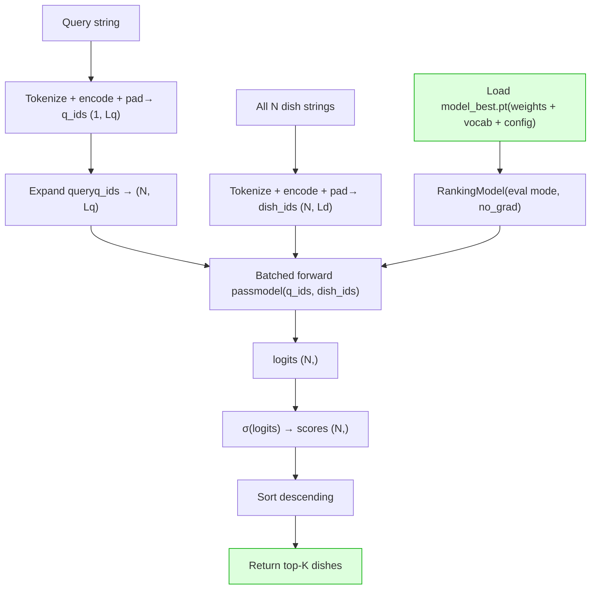

# Swiggy Search Ranking – Query → Dish Matcher

This project implements a small, from-scratch PyTorch model that ranks dishes for a free‑text query
(e.g. “dessert with carrots”, “spicy south indian main course”) as part of the Swiggy AI Engineer
assignment (Challenge 2 – option B).

The model is:
- Trained from scratch (no pretrained models / Hugging Face)
- Small enough to train on a laptop
- Fast enough to score a full dish list in a single batched CPU forward pass

---

## 1. Setup

Create a virtual environment and install dependencies:

```bash
python -m venv venv
source venv/bin/activate        # Windows: venv\Scripts\activate
pip install -r requirements.txt
```

Project layout (key files):

```text
data/raw/indian_food.csv      # Kaggle source (not committed)
data/processed/train_pairs.csv
src/data_prep.py              # build training pairs from indian_food.csv
src/dataset.py                # vocab + RankingDataset
src/model.py                  # RankingModel (embeddings + MLP)
src/train.py                  # training loop
src/inference.py              # inference + latency benchmark
model_best.pt                 # saved checkpoint
README.md
DATA.md
```

---

## 2. Data preparation

1. Download **Indian Food 101** (`indian_food.csv`) from Kaggle.
2. Place it at:

```text
data/raw/indian_food.csv
```

3. Generate training pairs:

```bash
python -m src.data_prep
```

This creates:

```text
data/processed/train_pairs.csv   # columns: query, dish, label
```

A short description of how this file is built is in `DATA.md`.

---

## 3. Model (high level)

### Forward pass



### Training (backward pass)



### Inference



Training specifics:

- Loss: `BCEWithLogitsLoss`
- Optimizer: `Adam`
- Split: ~90% training, ~10% validation
- Best model checkpoint saved to `model_best.pt` (weights + vocab + config)

---

## 4. Training

With `data/processed/train_pairs.csv` ready, run:

```bash
python -m src.train
```

This will:

- Build the vocabulary and dataset
- Train for a small number of epochs on CPU
- Print train and validation loss/accuracy
- Save the best model to `model_best.pt`

---

## 5. Inference & latency

Run:

```bash
python -m src.inference
```

This script:

1. Loads `model_best.pt` and `indian_food.csv`
2. Rebuilds dish texts
3. For a few demo queries:
   - Scores all dishes in one batched forward pass
   - Prints the top matches as:

   ```text
   Query: dessert with carrots
     0.909  Gajar ka halwa
     0.906  Mawa Bati
     ...
   ```

4. Benchmarks batched scoring on CPU and prints something like:

```text
Benchmarking with N=255 dishes
Warm-up ... 4–5 ms
Steady-state ... 4–5 ms
```

This is comfortably under the requirement of scoring 500 items in under 100 ms on CPU.

---

## 6. Limitations (brief)

- Doesn’t strictly enforce diet / course / time
- Region sometimes dominates over “dessert / main”
- Health queries (low sugar / high protein) weak
- Bag-of-words encoder, no word order
- Unknown words collapsed into one <unk> token
- Evaluated on synthetic queries, not real traffic
